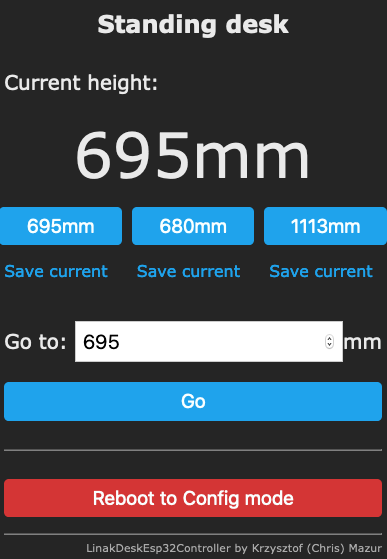

# ***Work in progress, use at own risk!***

# LinakDeskEsp32Controller

The goal of this project is creating an easy to use bluetooth bridge for my Ikea Idasen desk, that uses a Linak controller.

I often switch computers, that's why the desktop controllers do not suit me, but they were a great source of information - you can see the links in the references section.

# Getting started
1. Compile the `esp32dev` environment and upload the binary to an esp32.
2. Connect to the Access Point starting with ESP_[...]
3. Fill out your WiFi credentials, desk name and desk Bluetooth address
4. Save your configuration and wait for the ESP to connect to WiFi and your desk.  
   (For the first connection you will need to press the pairing button on the desk.)
5. Test it! :)

Current implementation offers a simple HTTP GET API for getting the height and moving to height:
```
standing-desk.local/getHeight
```

```
standing-desk.local/moveToHeight?destination=700
```  
You can also use values in milimeters using:
```
standing-desk.local/getHeightMm
```

```
standing-desk.local/moveToHeightMm?destination=1000
```
Aditionally you can save current height as one of three (1-3) favorite positions to make the desk stop there when moving manually:
```
standing-desk.local/saveCurrentPosAsFav?position=3
``` 

mDNS name will be set from the desk name set in WiFiManager, with the spaces changed to `-`.

You can use the IP address of the device if you're having problems with mDNS

To change the settings reboot the ESP twice within 10 seconds and connect to the created WiFi.

# Web UI

At the root URL there is an Web UI for moving the desk and setting the favorite positions.


# References
* https://github.com/zewelor/linak_bt_desk/
* https://github.com/anetczuk/linak_bt_desk/
* https://github.com/anson-vandoren/linak-desk-spec